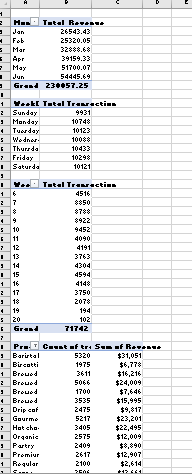
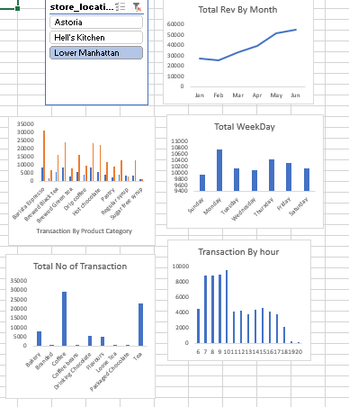

## Introduction/Project Overview 
This Data Analysis project aims to provide insight of three coffee and tea shops located in New York City, specifically in Lower Manhattan, Hell's Kitchen and Astoria. From this dataset analysis, we are to understand sales trends,patterns and customer behavior, to analyze the performance of different products, to identify peak sales hours and days, to identify trend in customer’s Purchases, and to evaluate the revenue generated by various categories of products.
## Data Source:
Coffee Shop Sales Raw File.xlsx. The primary  Dataset of this Project contained detailed transaction information of three coffee shops including Transaction IDs, Dates,Times, Quantities, Store Ids, Location, Product IDS, Product Type, Product Details,Unit Price, Product Category. The Data covers transactions from three shops from January to June 2023. the dataset is an Excel File by the company.
## Data Description
The dataset is made up of detailed records from three coffee shops over a period of time. The data has the following columns:•	Transaction_id: Unique identifier for each transaction,•	transaction_date: Date when the transaction took place•	transaction_time: The exact Time of transaction, •	transaction_qty: Quantity of items purchased in the transaction,•	store_id: Identifier for the store where the transaction took place.	store_location: Location of the store.•	product_id: Unique identifier for the product.  •	unit_price: Price per unit of the product.•	product_category: Category of the product (e.g., Coffee, Tea, Bakery, Drinking Chocolate).•	product_type: Type of product (e.g., Gourmet brewed coffee, Brewed Chai tea). 	product_detail: Detailed description of the product.•	Revenue: Total revenue generated from the transaction. •	Month: Month  the transaction occured.

## Problem Statement
- Total Sales by Product Category: Summarizing total sales for each product category.
- Total revenue generated by each store: This shows the total revenue generated by each store.
- Sales Trend by Hour:	Identify peak sales hours and determine the most popular times of day for transactions.
- Total Revenue by Store Location: Compare the overall sales performance among the three store locations.
- Total Revenue by Quantity: Identify the most popular products based on the quantity sold and revenue generated.
- Purchasing Trend in a given Period: Identify patterns in customer purchasing behavior, such as the frequency of purchases for specific product categories and types.
- Sales Trend within the day : Analyze the distribution of transactions throughout the day.
- Revenue Trend by hour: Compare the hourly revenue trends among the three stores.
  ## Skills/Concepts Demostrated
  ### Data Cleaning and preparation
  -  Data collection, sorting snd filtering.
  -  Remove Duplicate
  -  Text Functions
	-  Date and Time Functions
  -  Data Validation and Analysis
  -  Pivot Tables
  -  Pivot Charts:
	-  Formulas function
	-  Charts and Graphs
  -  Slicers 
  -  Advanced Analysis Reporting and Dashboarding
  -  Dashboard Creation
  ## Data Cleaning/ Transformation
   In the beginning of Data Preparation Phase, the following tasks were performed.
  
  1.  A column for Revenue was added using operator =D2*H2.
  2.  A column for month was added using =TEXT(B2,"mm")
  3.  A column for monthName was added =TEXT(B2,"mmm")
  4.  A column for weekday was added using =WEEKDAY(B2,2)
  5.  A column for WeekDay Name was added using =TEXT(B2,"DDDD")
  6.  A column for Hour using =HOUR(C2)
  ## Analysis and Summaries With Pivot Tables
  
  
1. Rows: Month
- Values: Sum of unit price * transaction qty
- This analysis showed the total Revenue revenue generated in each Month.
2.Total Transaction per Day of Week
- Rows: WeekdayName
- Values: Count of Transaction id
- This analysis showed the count of transactions each week day.
3. Total Transaction by hour of Day
- Rows: Hour
- Values: Count of Transaction id
- This analysis showed the count of transactions each week day.
4. Total Transaction per product category
- Rows: product_category
- Values: Count of Transaction_id
- This analysis  showed the count of transactions per product_category .
5. Number of transactions and revenue by product_type and filtered to the top 15(by transaction)
- Rows: product_type
- Values: Count of Transaction_id, Sum of Revenue
- This analysis showed the count of transactions and Sum of Revenue per product type by transaction.
 
   
   ## Visualization
  
  ## Results/ Findings
1. The dataset of Coffee and Tea Shops shows a great Trend of Revenue From Month of January to June. In the month of 
   June the highest Revenue was recorded while in Febuary the lowest revenue was recorded.The revenue started 
   increasing from March, but has a strong growth from April to June.There was a big renge of growth noted in the 
   month of May and June.
2.  The Data shows the weekday transaction from Sunday to Saturday, the trend is that Monday records the highest 
    sales, followed by Thursday and friday respectivly. There was a slight fluctation on Tuesday and 
    Wednesday.Saturday records the lowest sales.
3. From thecdata, Sales are distributed throughout the early morning hours, starting from 7:06 AM to 8:17 AM. The 
   high 
   sales starts at 7.00AM and gets to it's peak at 10.00 Am.The Pattern is that transactions are high in the morning 
   and less in the evening.
4. Based on Product category, coffee is the most popular category, followed by Tea. They contribute greatly to the 
   general revenue.
   Products like Hot chocolate and Gourmet brewed coffee, despite their higher prices, show strong sales, indicating 
   a preference for quality over cost among customersThe data shows that there are preference for Coffee and tea, 
   Bakery Products also brought a fair share to the revenue.
## Recommendations
- I recommend that Focus will be  on promoting the top-selling item like coffee and teas.
- Give discounts on these top selling products during peak hours to attract more customerss.
- The data shows early morning hours, particularly around 7:00 AM to 8:00 AM, as high-traffic times. Provide adequate 
  staffing during these peak hours to handle the increased customer flow efficiently.
- To bring traffic during low-peak hours, consider introducing time-limited offers or discounts. Introduce more 
  varities, new flavors and seasonal teas to attract tea enthusiasts.
- Make sure popular products are always available.
- Always train staff on good service techniques and product knowledge to improve customer experience and speed up 
  service.
- Make constant Adverts and posts on social media platforms to showcase new products. Also, engage with customer 
  regularly through stories and feedback polls. Introduction of high and efficient marketing strategies in those low- 
  peak sales areas.
-  Allow customers to customize their drinks like add extra shots, choose milk alternatives e.t.c to cater 
  to diverse preferences and highlight these options on the menu.
- Implement a customer loyalty programs where frequent buyers can accumulate points for discounts or free items. This 
  can encourage repeat business and increase customer retention.
  By implementing these recommendations and insights, the business can enhance customer satisfaction, optimize operations, and ultimately increase revenue.
  

   

  

